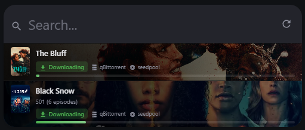
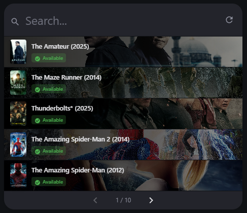

# Arr Queue Card


A custom Lovelace card for Home Assistant that displays your Radarr and Sonarr download queues and libraries in a beautiful, modern interface.

| Queue Mode | Library Mode |
|:---:|:---:|
|  |  |

## Features

- **Radarr & Sonarr Support**: Use one or both - combine into a single unified queue
- **Visual Editor**: Configure the card using the UI - no YAML required
- **Posters & Fanart**: Beautiful backgrounds from TMDB/TVDB
- **Live Search**: Filter items by title with instant results
- **Download Progress**: Animated progress bars with status indicators
- **Episode Info**: Sonarr items show episode identifiers (S01E01 - Episode Title)
- **Pagination**: Navigate through large lists with ease
- **Compact Mode**: Space-efficient layout for smaller displays
- **Fully Configurable**: Toggle visibility of all UI elements

## Requirements

- Home Assistant **2026.3** or newer
- [Radarr](https://www.home-assistant.io/integrations/radarr/) and/or [Sonarr](https://www.home-assistant.io/integrations/sonarr/) integration configured in Home Assistant

## Installation

### HACS (Recommended)

1. Open HACS in Home Assistant
2. Go to "Frontend" section
3. Click the three dots menu and select "Custom repositories"
4. Add this repository URL and select "Lovelace" as the category
5. Install "Arr Queue Card"
6. Refresh your browser

### Manual Installation

1. Download `arr-media-carrd.js` from the [latest release](../../releases)
2. Copy it to your `config/www` folder
3. Add the resource in Home Assistant:
   - Go to **Settings** → **Dashboards** → **⋮ menu** (top right) → **Resources**
   - Click **Add Resource**
   - URL: `/local/arr-media-carrd.js`
   - Type: **JavaScript Module**

## Configuration

### Basic Configuration

```yaml
# Radarr only
type: custom:arr-media-card
radarr:
  entry_id: YOUR_RADARR_ENTRY_ID

# Sonarr only
type: custom:arr-media-card
sonarr:
  entry_id: YOUR_SONARR_ENTRY_ID

# Both combined
type: custom:arr-media-card
radarr:
  entry_id: YOUR_RADARR_ENTRY_ID
sonarr:
  entry_id: YOUR_SONARR_ENTRY_ID
```

### Full Configuration

```yaml
type: custom:arr-media-card
radarr:
  entry_id: YOUR_RADARR_ENTRY_ID
sonarr:
  entry_id: YOUR_SONARR_ENTRY_ID
view_mode: queue
max_items: 50
items_per_page: 5
refresh_interval: 60
show_fanart: true
compact_mode: false
show_count: true
show_tracker: true
show_download_client: true
show_refresh_button: true
```

### Options

| Name | Type | Default | Description |
|------|------|---------|-------------|
| `radarr` | object | - | Radarr instance config (`entry_id` required) |
| `sonarr` | object | - | Sonarr instance config (`entry_id` required) |
| `view_mode` | string | `queue` | Display mode: `queue` or `library` |
| `max_items` | number | `50` | Maximum total items to fetch |
| `items_per_page` | number | `5` | Items per page (pagination appears if more) |
| `refresh_interval` | number | `60` | Seconds between auto-refresh |
| `show_fanart` | boolean | `true` | Show fanart as background |
| `compact_mode` | boolean | `false` | Use compact layout |
| `show_count` | boolean | `false` | Show item count badge |
| `show_tracker` | boolean | `true` | Show indexer/tracker name (queue mode) |
| `show_download_client` | boolean | `true` | Show download client name (queue mode) |
| `show_refresh_button` | boolean | `false` | Show manual refresh button |

### View Modes

**Queue Mode** (`view_mode: queue`):
- Shows items currently in the download queue
- Displays download progress, status, download client, and tracker
- Sonarr items show episode info (e.g. S01E01 · The Pilot)


**Library Mode** (`view_mode: library`):
- Shows items in your library
- Displays availability status, year, and file size
- Sonarr series are expandable — browse episodes grouped by season with availability counts

| Radarr Library | Sonarr Library |
|:---:|:---:|
|  |  |

### Finding Your Entry ID

When using the **visual editor**, your Radarr and Sonarr integrations are automatically detected and shown in dropdown menus - no need to find entry IDs manually.

For YAML configuration, you can find the `entry_id` by:

1. Go to **Developer Tools** → **Actions**
2. Search for `radarr.get_queue` or `sonarr.get_queue`
3. The entry ID will be shown in the service call data

## Development

### Prerequisites

- Node.js 18+
- npm

### Setup

```bash
npm install
```

### Build

```bash
npm run build
```

### Watch Mode

```bash
npm run watch
```

The built file will be in `dist/arr-media-carrd.js`.

## License

MIT
